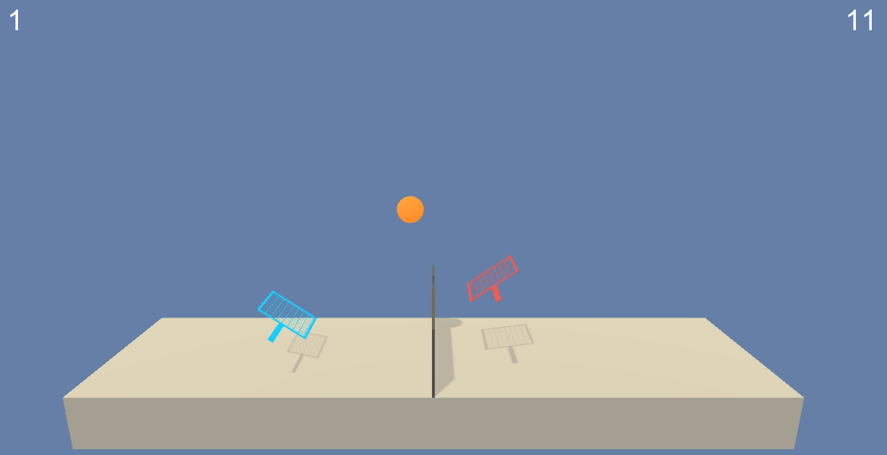

# UdacityRL-CollaborationAndCompetitionProject
Project Three Submission for Udacity Reinforcement Learning Course

This is an implementation of the Deep Deterministic Policy Gradients Algorithm for training a agent to play tennis.  The environment contains two agents.  Each agent has a continuous action space corresponding horizontal and vertical paddle motion.  Each agent's observation space consists of the position and velocity of the ball and its racket.  An agent is assigned a reward of +0.1 each time it hits the ball over the net, and a reward of -0.01 if it hits the ball out of bounds, or lets the ball drop on its side of the play area.

To solve the environment, a running average, over 100 consecutive episodes, of the maximum score between the two agents, must be at least +0.5.

## Environment Setup

+ Follow instructions [here](https://github.com/udacity/Value-based-methods#dependencies) to set up the environment, *with the following changes:*
  - Before running `pip install .`, edit `Value-based-methods/python/requirements.txt` and remove the `torch==0.4.0` line
  - After running `pip install .`, run the appropriate PyTorch installation command for your system indicated [here](https://pytorch.org/get-started/locally/)
  - Continue following the instructions [here](https://github.com/udacity/Value-based-methods#dependencies) to their conclusion.
+ Download the appropriate Unity Environment for your platform:
  - [Linux](https://s3-us-west-1.amazonaws.com/udacity-drlnd/P3/Tennis/Tennis_Linux.zip)
  - [Mac OSX](https://s3-us-west-1.amazonaws.com/udacity-drlnd/P3/Tennis/Tennis.app.zip)
  - [Windows (32-bit)](https://s3-us-west-1.amazonaws.com/udacity-drlnd/P3/Tennis/Tennis_Windows_x86.zip)
  - [Windows (64-bit)](https://s3-us-west-1.amazonaws.com/udacity-drlnd/P3/Tennis/Tennis_Windows_x86_64.zip)
+ Place the Unity Environment zip file into any convenient directory, and unzip the file.
+ Clone this repository and open CollaborationCompetitionCode.ipynb in a Jupyter Notebook instance, and follow the instructions there.
